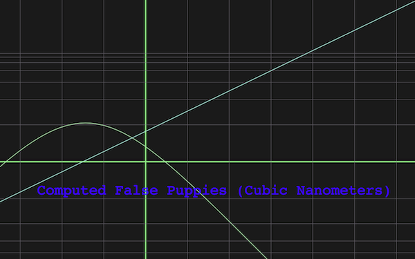

StatGrapher
===========

OS X Screensaver - Draws Random Graphs. Based on memories of an ancient (Mac OS 7 era) screensaver named GraphStat.



A binary StatGrapher.saver.tgz is available in the releases section. Extract this and double-click on the StatGrapher.saver package to install. You may need to ctrl-right-click + open to get around the OS X installation security policy. Install for one user. Mountain Lion or later is required.

You can change the text that is used in the graph headings. Create a text file named:

```
~/Library/Application\ Support/com.apple.ScreenSaver.Engine/statgrapher_words
```

The format is line-oriented with 4 sections delimited by the section number enclosed in asterisks.

```
*1*
World
List
One
*2*
you get
the
idea
*3*
force
power
strength
*4*
(parenthesized)
[words]
- go here -
```

The statgrapher_words file in the root directory of the source code is based on the word list from the original screensaver, and may be dropped into place and used as a basis for modification.

```
mkdir ~/Library/Application\ Support/com.apple.ScreenSaver.Engine
curl https://raw.github.com/mypalmike/StatGrapher/master/statgrapher_words ~/Library/Application\ Support/com.apple.ScreenSaver.Engine/statgrapher_words
```
